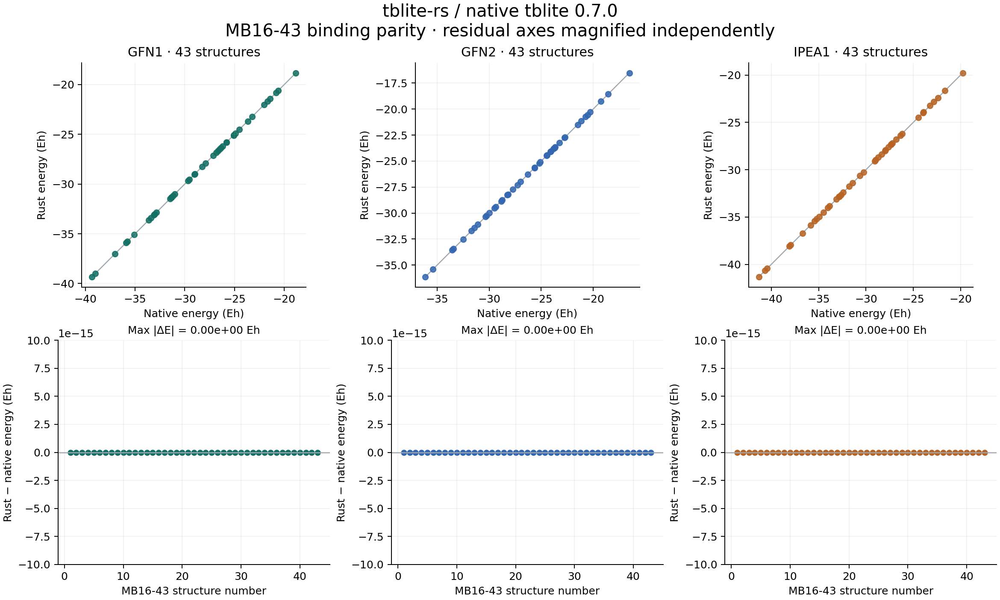

# MB16-43 native / Rust parity

Result: **PASS**. 129/129 attempted pairs compared; 0 execution or validation failures. Full benchmark requires 129 pairs.

Both routes use native tblite 0.7.0. This tests binding fidelity on the 43 MB16-43 target geometries, not accuracy against the GMTKN55 reference reaction energies.

Run: 2026-09-06T10:11:15.207523+00:00 on Linux-6.18.33.2-microsoft-standard-WSL2-x86_64-with-glibc2.35.

Settings: gas phase, original charge/spin, one electronic spin channel with alpha/beta occupations, SAD guess, accuracy 0.01, at most 250 SCF steps, 300 K using tblite 0.7.0's legacy conversion (kT = 0.000950042573563535 Eh), fresh calculator per case, one OpenMP/BLAS thread.

| Method | Property | Max absolute error | RMSE | Bound | Unit | Worst molecule | Pass |
| --- | --- | ---: | ---: | ---: | --- | --- | --- |
| gfn1 | energy | 0.000e+00 | 0.000e+00 | 1.0e-08 | Eh | MB16-43-01 | True |
| gfn1 | energies | 0.000e+00 | 0.000e+00 | 1.0e-08 | Eh | MB16-43-01 | True |
| gfn1 | gradient | 0.000e+00 | 0.000e+00 | 1.0e-07 | Eh/Bohr | MB16-43-01 | True |
| gfn1 | virial | 1.665e-16 | 3.462e-17 | 1.0e-06 | Eh | MB16-43-11 | True |
| gfn1 | charges | 0.000e+00 | 0.000e+00 | 1.0e-06 | e | MB16-43-01 | True |
| gfn1 | dipole | 0.000e+00 | 0.000e+00 | 1.0e-05 | e Bohr | MB16-43-01 | True |
| gfn1 | quadrupole | 0.000e+00 | 0.000e+00 | 1.0e-04 | e Bohr^2 | MB16-43-01 | True |
| gfn2 | energy | 0.000e+00 | 0.000e+00 | 1.0e-08 | Eh | MB16-43-01 | True |
| gfn2 | energies | 0.000e+00 | 0.000e+00 | 1.0e-08 | Eh | MB16-43-01 | True |
| gfn2 | gradient | 0.000e+00 | 0.000e+00 | 1.0e-07 | Eh/Bohr | MB16-43-01 | True |
| gfn2 | virial | 1.110e-16 | 3.517e-17 | 1.0e-06 | Eh | MB16-43-05 | True |
| gfn2 | charges | 0.000e+00 | 0.000e+00 | 1.0e-06 | e | MB16-43-01 | True |
| gfn2 | dipole | 0.000e+00 | 0.000e+00 | 1.0e-05 | e Bohr | MB16-43-01 | True |
| gfn2 | quadrupole | 0.000e+00 | 0.000e+00 | 1.0e-04 | e Bohr^2 | MB16-43-01 | True |
| ipea1 | energy | 0.000e+00 | 0.000e+00 | 1.0e-08 | Eh | MB16-43-01 | True |
| ipea1 | energies | 0.000e+00 | 0.000e+00 | 1.0e-08 | Eh | MB16-43-01 | True |
| ipea1 | gradient | 0.000e+00 | 0.000e+00 | 1.0e-07 | Eh/Bohr | MB16-43-01 | True |
| ipea1 | virial | 1.665e-16 | 3.087e-17 | 1.0e-06 | Eh | MB16-43-04 | True |
| ipea1 | charges | 0.000e+00 | 0.000e+00 | 1.0e-06 | e | MB16-43-01 | True |
| ipea1 | dipole | 0.000e+00 | 0.000e+00 | 1.0e-05 | e Bohr | MB16-43-01 | True |
| ipea1 | quadrupole | 0.000e+00 | 0.000e+00 | 1.0e-04 | e Bohr^2 | MB16-43-01 | True |

Energy correlations (descriptive; pass/fail uses absolute errors):

- gfn1: Pearson r = 1; identity-line R² = 1.
- gfn2: Pearson r = 1; identity-line R² = 1.
- ipea1: Pearson r = 1; identity-line R² = 1.

[Raw paired values and run provenance](results.json) · [Metrics CSV](summary.csv) · [Per-case CSV](cases.csv)

Molecular virials are included, but this gas-phase set does not establish periodic, solvation, field or explicitly spin-polarized parity. Numerical agreement is specific to the recorded build and platform; other builds must rerun the benchmark.

