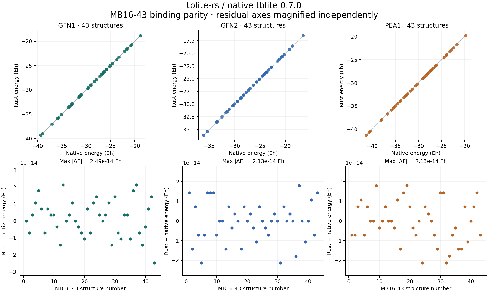

# MB16-43 native / Rust parity

Result: **PASS**. 129/129 attempted pairs compared; 0 execution or validation failures. Full benchmark requires 129 pairs.

Both routes use native tblite 0.7.0. This tests binding fidelity on the 43 MB16-43 target geometries, not accuracy against the GMTKN55 reference reaction energies.

Run: 2026-09-06T10:08:40.486710+00:00 on Windows-11-10.0.26200-SP0.

Settings: gas phase, original charge/spin, one electronic spin channel with alpha/beta occupations, SAD guess, accuracy 0.01, at most 250 SCF steps, 300 K using tblite 0.7.0's legacy conversion (kT = 0.000950042573563535 Eh), fresh calculator per case, one OpenMP/BLAS thread.

| Method | Property | Max absolute error | RMSE | Bound | Unit | Worst molecule | Pass |
| --- | --- | ---: | ---: | ---: | --- | --- | --- |
| gfn1 | energy | 2.487e-14 | 1.058e-14 | 1.0e-08 | Eh | MB16-43-43 | True |
| gfn1 | energies | 2.487e-14 | 2.546e-15 | 1.0e-08 | Eh | MB16-43-42 | True |
| gfn1 | gradient | 2.630e-15 | 2.829e-16 | 1.0e-07 | Eh/Bohr | MB16-43-38 | True |
| gfn1 | virial | 6.863e-15 | 1.467e-15 | 1.0e-06 | Eh | MB16-43-42 | True |
| gfn1 | charges | 6.523e-14 | 5.774e-15 | 1.0e-06 | e | MB16-43-42 | True |
| gfn1 | dipole | 2.314e-13 | 4.957e-14 | 1.0e-05 | e Bohr | MB16-43-41 | True |
| gfn1 | quadrupole | 1.634e-12 | 2.939e-13 | 1.0e-04 | e Bohr^2 | MB16-43-41 | True |
| gfn2 | energy | 2.132e-14 | 9.752e-15 | 1.0e-08 | Eh | MB16-43-05 | True |
| gfn2 | energies | 1.370e-13 | 9.591e-15 | 1.0e-08 | Eh | MB16-43-12 | True |
| gfn2 | gradient | 3.550e-14 | 1.846e-15 | 1.0e-07 | Eh/Bohr | MB16-43-12 | True |
| gfn2 | virial | 6.636e-14 | 6.818e-15 | 1.0e-06 | Eh | MB16-43-13 | True |
| gfn2 | charges | 3.534e-13 | 2.495e-14 | 1.0e-06 | e | MB16-43-12 | True |
| gfn2 | dipole | 5.578e-12 | 6.549e-13 | 1.0e-05 | e Bohr | MB16-43-12 | True |
| gfn2 | quadrupole | 2.491e-11 | 2.259e-12 | 1.0e-04 | e Bohr^2 | MB16-43-12 | True |
| ipea1 | energy | 2.132e-14 | 1.032e-14 | 1.0e-08 | Eh | MB16-43-24 | True |
| ipea1 | energies | 4.630e-14 | 4.303e-15 | 1.0e-08 | Eh | MB16-43-30 | True |
| ipea1 | gradient | 8.471e-15 | 6.042e-16 | 1.0e-07 | Eh/Bohr | MB16-43-13 | True |
| ipea1 | virial | 1.704e-14 | 2.527e-15 | 1.0e-06 | Eh | MB16-43-13 | True |
| ipea1 | charges | 1.104e-13 | 1.010e-14 | 1.0e-06 | e | MB16-43-30 | True |
| ipea1 | dipole | 1.260e-12 | 1.494e-13 | 1.0e-05 | e Bohr | MB16-43-30 | True |
| ipea1 | quadrupole | 7.113e-12 | 7.255e-13 | 1.0e-04 | e Bohr^2 | MB16-43-30 | True |

Energy correlations (descriptive; pass/fail uses absolute errors):

- gfn1: Pearson r = 1; identity-line R² = 1.
- gfn2: Pearson r = 1; identity-line R² = 1.
- ipea1: Pearson r = 0.9999999999999996; identity-line R² = 1.

[Raw paired values and run provenance](results.json) · [Metrics CSV](summary.csv) · [Per-case CSV](cases.csv)

Molecular virials are included, but this gas-phase set does not establish periodic, solvation, field or explicitly spin-polarized parity. Numerical agreement is specific to the recorded build and platform; other builds must rerun the benchmark.

